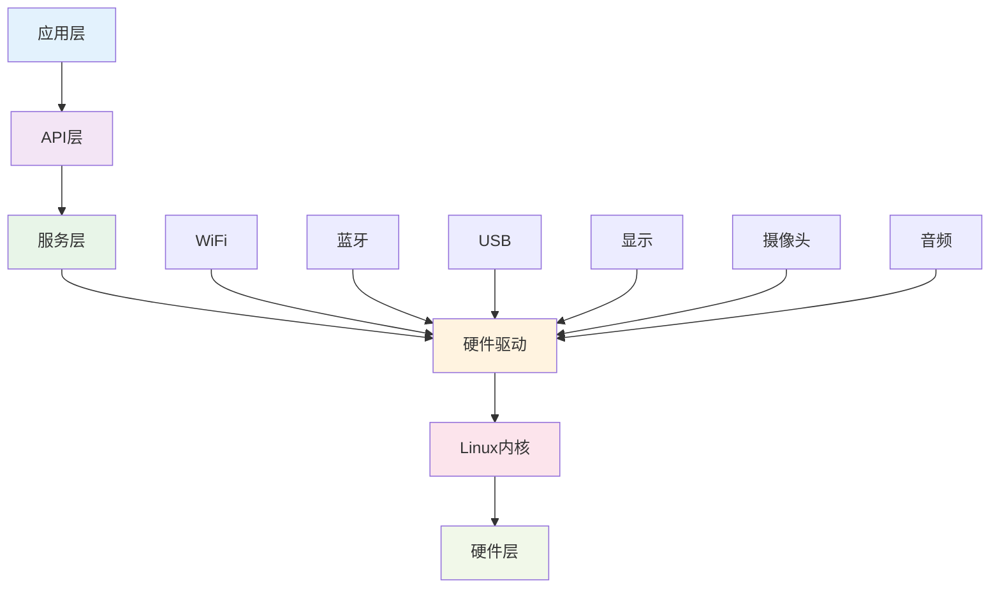

# 🥽 AI智能眼镜

**一个基于Linux的开源智能眼镜平台，适用于医疗、工业、教育和消费应用**

[](https://github.com/ezxrdev/OpenSource-Ai-Glasses/actions)
[](https://github.com/ezxrdev/OpenSource-Ai-Glasses/actions)
[](LICENSE)
[](https://github.com/Iam5stillLearning/OpenSource-Ai-Glasses/releases)
[](README.md)

[文档中心](docs/README.md) • [快速入门](docs/tutorials/beginner/getting-started.md) • [API参考](docs/firmware/api-reference.md) • [社区](docs/community/contributing.md)

---

## 📋 项目概述

这是一个基于Linux的开源智能眼镜工程，目前处于早期阶段，文档完善度5%。

**联系作者**: iam5stilllearning@foxmail.com

**语言**: English Version | [中文版本](README.zh.md)

## ✨ 核心特性

- 🖥️ **显示**: 30°FOV 640×480单色单目显示（选配）
- 📸 **摄像头**: 4K拍照1080P录像
- 🔊 **音频**: 双麦克风+扬声器
- 📡 **连接**: WiFi、蓝牙5.0、USB 2.0
- ⚡ **性能**: 单Cortex-A7核，32GB存储
- 🔋 **续航**: 听歌3小时，显示4小时，录像45分钟
- ⚖️ **重量**: 仅43g
- 🧠 **传感器**: 选配地磁传感器、IMU
- 🐧 **系统**: 完整Linux系统

## 🚀 快速开始

### 前置条件

- Linux开发环境（推荐Ubuntu 20.04+）
- Git和基础开发工具
- USB-C数据线连接设备

### 安装

```bash
# 克隆仓库
git clone https://github.com/Iam5stillLearning/OpenSource-Ai-Glasses.git
cd OpenSource-Ai-Glasses

# 设置开发环境
./scripts/setup-dev.sh

# 刷写固件
./scripts/flash-firmware.sh

# 验证安装
./scripts/verify-installation.sh
```

### Hello World

```bash
# 通过ADB连接设备
adb connect [设备IP]

# 运行Hello World应用
adb shell /opt/apps/hello-world

# 预期输出: "Hello AI Glasses!"
```

## 📊 硬件规格

| 组件 | 规格 |
|------|------|
| **处理器** | 单Cortex-A7核 |
| **内存** | 32GB存储（可配置） |
| **显示** | 30°FOV 640×480单色单目（选配） |
| **摄像头** | 4K拍照，1080P录像 |
| **音频** | 双麦克风+扬声器 |
| **连接** | WiFi，蓝牙5.0，USB 2.0 |
| **电池** | 180mAh |
| **重量** | 43g |
| **续航** | 听歌3小时，显示4小时，录像45分钟 |

## 🎯 应用场景

### 🏥 医疗应用

<details>
<summary>医疗AI智能眼镜场景</summary>

#### 智能识别患者身份与信息
医生或护士一进入病房，眼镜通过人脸识别或腕带扫描，瞬间在视野角落显示患者姓名、床号、主要诊断、过敏史和关键生命体征，无需反复查阅病历夹或电脑。

#### 实时生命体征监测与预警
眼镜能实时读取并整合床旁监护仪、输液泵等设备数据。一旦患者心率、血氧、血压等指标出现异常波动，系统会立即在视野中高亮警示，并通过骨传导耳机发出轻柔但明确的预警声。

#### 辅助操作与规程核对
在执行输液、给药等操作时，眼镜的摄像头会自动扫描药品条码与患者腕带，核对"三查七对"信息。若发现药物剂量错误、患者不匹配或存在过敏风险，会立即以醒目方式弹出警告，杜绝医疗差错。

#### 无接触调阅与记录信息
医生进行查房或操作时，可通过语音指令或手势，在空中虚拟调阅患者的电子病历、影像报告（如CT/MRI），并将口述的查房记录实时转为文字存入系统，实现"所见即所记"，极大解放双手。

#### 远程专家协作与指导
在复杂会诊或紧急抢救时，低年资医生可第一视角共享实时画面给远端专家。专家可在共享画面上进行标注、圈出重点，并通过语音通讯进行指导，如同专家亲临现场，提升基层医疗水平。

</details>

### 🏭 工业应用

<details>
<summary>变电站应用场景</summary>

#### 看懂操作票
甭管是纸质的还是电子的操作票，眼镜一扫，它能自己把上面的关键信息（比如要操作哪个设备、是合上还是断开）给提取出来，不用我再去一个字一个字地手动输入核对。

#### 认识现场设备
戴着眼镜在变电站里走，它就像个老巡检员一样，能通过摄像头和AI实时认出眼前的是断路器、隔离开关还是接地刀闸。

#### 有安全规矩
系统内置了所有的电力安全规程和"五防"逻辑。能把我刚才识别的操作指令和现在眼前看到的真实设备状态进行比对，判断我下一步操作会不会出事。

#### 及时开口提醒
一旦它发现我可能要走错间隔、或者要操作错误的设备，马上就会用声音警告，比如"错误！这是102开关，请核对！"，阻止犯错。整个过程必须是实时的，不能有延迟。

#### 在现场独立干活
所有的计算和判断都支持本地部署，确保在网络不稳定的急诊或ICU区域功能不受影响。

</details>

<details>
<summary>维修场景</summary>

#### 实时视频通话与画面共享
现场维修人员通过眼镜摄像头，将故障设备的第一视角实时视频共享给后方的专家团队。专家无需亲临现场，即可如亲眼所见，精准把握现场状况。维修时解放双手。

#### AR标注与实时指导
专家可以在共享的视频画面上进行AR标注（如画圈、箭头指示、文字注释），直接"投射"到现场人员的视野中，精确指导其"拧这个螺丝"、"测量那个点的电压"，极大提升沟通效率。

#### 多方会诊与知识沉淀
支持多位专家同时接入一个视频会话，进行"多方会诊"，快速解决复杂难题。整个指导过程可录制存档，形成针对特定故障的维修案例库，用于后续培训。

#### 文件与图纸即时调阅
现场人员可通过语音指令，请求专家远程推送图纸、手册或3D模型等文件。专家可将资料直接发送并显示在维修人员的眼镜视野一侧，边看边操作。

</details>

### 🎓 教育应用

<details>
<summary>AR智能作业指导与流程确认</summary>

#### 可视化操作清单
将复杂的SOP（标准作业程序）分解为一步步的AR指令，直接叠加显示在操作员视野中的真实设备上。当前需要执行的操作步骤会高亮提示，完成一步，自动进入下一步。

#### 工具与物料识别
眼镜能识别操作员拿起的是否为当前步骤指定的工具或物料。若拿错，会立即发出警示，防止因使用错误工具导致的设备损坏或装配问题。

#### 自动步骤确认与记录
系统通过视觉识别自动判断某个步骤是否已完成（如"螺丝已拧紧"、"线缆已插接到位"），并自动记录完成时间和操作员信息，实现无纸化且防错的流程确认。

#### 手忙时语音导航
在操作员双手被占用时，可通过语音指令"下一步"、"上一步"、"重复"来控制指导流程的播放，完全解放双手，聚焦于操作本身。

#### 新人培训与技能传承
新员工可依靠AR指导快速上岗，减少培训成本和出错率。老师傅的最佳实践和操作技巧也能通过AR流程固化下来，实现高效的知识传承和标准化作业。

</details>

## 🏗️ 系统架构



## 📚 文档

- [📖 完整文档](docs/README.md)
- [🚀 入门指南](docs/tutorials/beginner/getting-started.md)
- [🔧 硬件规格](docs/hardware/specifications.md)
- [💻 固件开发](docs/firmware/getting-started.md)
- [📱 应用开发](docs/software/app-development.md)
- [🔍 故障排除](docs/troubleshooting/common-issues.md)

## 🛠️ 开发

### 从源码构建

```bash
# 安装依赖
sudo apt-get update
sudo apt-get install build-essential git cmake

# 克隆并构建
git clone https://github.com/Iam5stillLearning/OpenSource-Ai-Glasses.git
cd OpenSource-Ai-Glasses
mkdir build && cd build
cmake ..
make -j4

# 刷写到设备
sudo make flash
```

### 开发工具

- **IDE**: VS Code with C/C++ extension
- **调试器**: GDB + OpenOCD
- **性能分析**: perf, valgrind
- **版本控制**: Git

### API概述

```c
#include "ai_glasses_api.h"

// 初始化设备
int device_init(device_config_t *config);

// 拍照
int capture_photo(const char *filename);

// 显示文本
int display_text(const char *text, int x, int y);

// 播放音频
int play_audio(const char *filename);

// 获取传感器数据
int get_sensor_data(sensor_data_t *data);
```

## 🤝 贡献

我们欢迎各种形式的贡献！请查看我们的[贡献指南](docs/community/contributing.md)了解详情。

### 如何贡献

1. 🍴 Fork 本仓库
2. 🌿 创建功能分支 (`git checkout -b feature/AmazingFeature`)
3. 💻 提交您的更改 (`git commit -m 'Add some AmazingFeature'`)
4. 📤 推送到分支 (`git push origin feature/AmazingFeature`)
5. 🔃 创建 Pull Request

### 开发领域

- 🐛 **Bug修复**: 报告和修复问题
- ✨ **新功能**: 提出并实现新功能
- 📚 **文档**: 改进指南和API文档
- 🧪 **测试**: 添加测试并提高覆盖率
- 🌐 **国际化**: 添加语言支持

## 📄 许可证

本项目采用 Apache License 2.0 许可证 - 查看 [LICENSE](LICENSE) 文件了解详情。

## 🙏 致谢

- [Linux Foundation](https://www.linuxfoundation.org/) 提供Linux操作系统支持
- [OpenCV](https://opencv.org/) 提供计算机视觉能力
- [BlueZ](https://www.bluez.org/) 提供蓝牙协议栈
- 社区贡献者和测试者

## 📞 联系我们

- **项目维护者**: [Iam5stilllearning](mailto:iam5stilllearning@foxmail.com)
- **问题反馈**: [GitHub Issues](https://github.com/Iam5stillLearning/OpenSource-Ai-Glasses/issues)
- **讨论**: [GitHub Discussions](https://github.com/Iam5stillLearning/OpenSource-Ai-Glasses/discussions)
- **文档**: [项目文档](docs/README.md)

## 🌟 Star历史

[](https://star-history.com/#Iam5stillLearning/OpenSource-Ai-Glasses&Date)

---

<div align="center">

**⭐ 如果这个项目对您有帮助，请给我们一个Star！**

由开源社区用❤️制作

</div>

---

**注意**: 本项目处于早期开发阶段（文档完整度5%）。我们积极寻求贡献者和反馈！

**最后更新**: 2025-10-27 | **版本**: v1.0.0